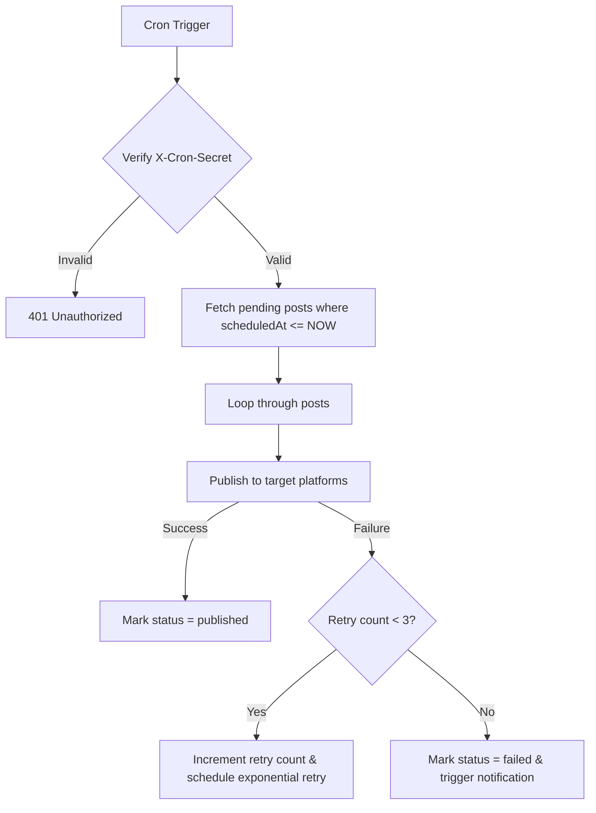

# Scheduler API

> **Overview**: The Scheduler API handles the background automation engine responsible for processing scheduled social media posts, executing cron tasks, retrying failed broadcasts, and managing task queues.

---

## Key Capabilities

- **Schedule Creation**: Queue social media posts for future execution.
- **Background Cron Trigger**: Internal or external cron runner trigger to execute due posts.
- **Failover & Retries**: Automatic exponential backoff retries (up to 3 attempts per post).

---

## Authentication & Security

- User scheduling actions require a valid Bearer JWT.
- System runner endpoint (`POST /api/social/scheduler/run`) uses a secret cron token header (`X-Cron-Secret` or `CRON_SECRET` env check) to prevent unauthorized executions.

---

## Endpoints

### `POST /api/social/schedule`

Schedules a social post payload for publishing at a future timestamp.

**Authentication**: Required (User Bearer Token)

**Request Body**:

```json
{
  "content": "Excited to launch our new UI UX design services! Check out our portfolio.",
  "platforms": ["linkedin", "bluesky"],
  "scheduledAt": "2026-07-30T15:00:00.000Z",
  "mediaIds": ["98765432-abcd-ef01-2345-6789abcdef01"]
}
```

**Success Response (200 OK)**:

```json
{
  "success": true,
  "data": {
    "scheduleId": "sch_1234567890",
    "status": "scheduled",
    "scheduledAt": "2026-07-30T15:00:00.000Z",
    "platforms": ["linkedin", "bluesky"]
  }
}
```

---

### `POST /api/social/scheduler/run`

Triggers the execution worker to pick up and broadcast all due posts whose `scheduledAt <= NOW()` and status is `pending`.

**Authentication**: Secret Cron Token Header (`X-Cron-Secret`)

**Request Headers**:

| Header | Description |
|--------|-------------|
| `X-Cron-Secret` | System cron authorization token |

**Success Response (200 OK)**:

```json
{
  "success": true,
  "data": {
    "processedCount": 4,
    "successfulCount": 4,
    "failedCount": 0,
    "executedAt": "2026-07-30T15:00:01.200Z"
  }
}
```

**cURL Example**:

```bash
curl -X POST https://api.gigpilot.ai/api/social/scheduler/run \
  -H "X-Cron-Secret: YOUR_CRON_SECRET_KEY"
```

---

## Scheduler Worker Execution Logic



---

## Related Documentation

- [Social API](social.md)
- [Notifications API](notifications.md)
- [Architecture Guide](../ARCHITECTURE.md)
